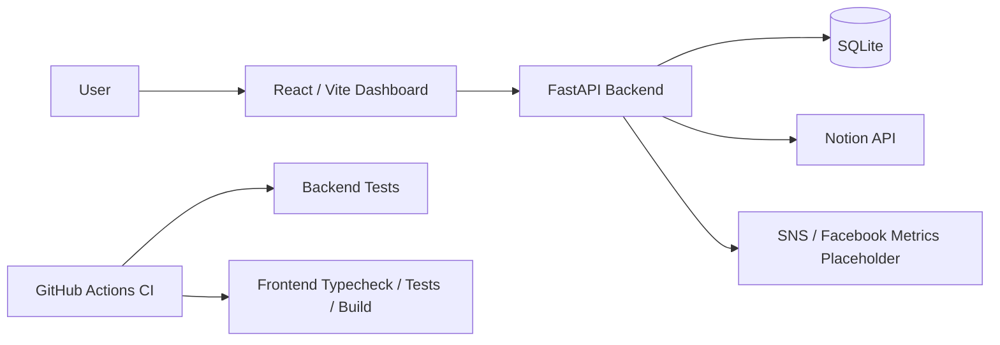

# Notion Creator Ops Dashboard

Notion上のタスク、SNS運用、ブログ/LP/開発、不動産物件のFacebook投稿を一元管理するフルスタック統合ダッシュボードです。

GPT Imageで生成したダークモードSaaS風の参照デザインをベースに、カード型KPI、かんばん、SNS反応トレンド、Facebook不動産投稿の確認パネルを1画面に集約しています。初回起動時はサンプルデータで動き、NotionのSecretsを設定すると既存タスクDBから同期できます。

## できること

- NotionタスクDB / データソースからタスクを同期
- 期限、優先順位、案件、カテゴリ、進捗率をかんばん方式で可視化
- SNS運用状況を X / Threads / Blog / Facebook 横断で確認
- 不動産物件のFacebook投稿予定、下書き、分析中ステータスを管理
- SQLiteにローカル保存し、FastAPI経由でReact画面へ表示
- CIでバックエンドテスト、フロントエンド型チェック、テスト、ビルドを自動実行

## アーキテクチャ



### 処理の流れ

1. Reactダッシュボードが `/api/dashboard-summary`、`/api/tasks`、`/api/social-posts`、`/api/property-posts` を呼び出します。
2. FastAPIがSQLiteから現在のタスク、SNS投稿、物件投稿を読み込みます。
3. 「Notionから同期」を押すと `/api/sync/notion` がNotion APIへ接続します。
4. Notionページの `Name / Status / Priority / Due Date / Project / Channel / Progress` を読み取り、SQLiteへupsertします。
5. フロントエンドは更新後の状態を再取得し、かんばんとKPIを再描画します。

## ローカル起動

```bash
# backend
python -m venv .venv
source .venv/bin/activate
pip install -r backend/requirements.txt
uvicorn app.main:app --app-dir backend --reload --port 8000

# frontend: 別ターミナル
npm install --prefix frontend
npm run dev --prefix frontend
```

ブラウザで `http://localhost:5173` を開きます。

## Notion連携に必要なSecrets

Secretsを設定しなくてもサンプルデータで画面は動きます。本番でNotionタスクを同期する場合は以下を設定します。

| 環境変数 | 必須 | 内容 |
| --- | --- | --- |
| `NOTION_API_KEY` | 本番必須 | Notion Integration Secret |
| `NOTION_TASK_DATABASE_ID` | 本番必須 | タスクDBまたはデータソースID |
| `NOTION_VERSION` | 任意 | 既定値 `2022-06-28` |
| `NOTION_PROP_TITLE` | 任意 | 既定値 `Name` |
| `NOTION_PROP_STATUS` | 任意 | 既定値 `Status` |
| `NOTION_PROP_PRIORITY` | 任意 | 既定値 `Priority` |
| `NOTION_PROP_DUE_DATE` | 任意 | 既定値 `Due Date` |
| `NOTION_PROP_PROJECT` | 任意 | 既定値 `Project` |
| `NOTION_PROP_CHANNEL` | 任意 | 既定値 `Channel` |
| `NOTION_PROP_PROGRESS` | 任意 | 既定値 `Progress` |
| `APP_DATABASE_PATH` | 任意 | SQLite保存先。既定値 `data/dashboard.sqlite3` |

`.env`例:

```bash
NOTION_API_KEY=secret_xxx
NOTION_TASK_DATABASE_ID=xxxxxxxxxxxxxxxxxxxxxxxxxxxxxxxx
NOTION_PROP_TITLE=Name
NOTION_PROP_STATUS=Status
NOTION_PROP_PRIORITY=Priority
NOTION_PROP_DUE_DATE=Due Date
NOTION_PROP_PROJECT=Project
NOTION_PROP_CHANNEL=Channel
NOTION_PROP_PROGRESS=Progress
```

## Notion側の推奨DBプロパティ

| プロパティ | 型 | 例 |
| --- | --- | --- |
| Name | Title | ブログ記事を書く |
| Status | Status / Select | 未着手、進行中、レビュー、完了、保留 |
| Priority | Select | low、medium、high、urgent |
| Due Date | Date | 2026-07-01 |
| Project | Select / Rich text | SNS運用、LP改善、不動産投稿 |
| Channel | Select | SNS、Blog、Landing Page、Development、Real Estate |
| Progress | Number | 0〜100 |

## 本番運用に必要なもの

- Notion Integrationと対象タスクDBへの接続権限
- `NOTION_API_KEY` と `NOTION_TASK_DATABASE_ID` をサーバーのSecretとして保存すること
- SQLiteを永続ボリュームに置くこと、またはPostgreSQL等へ置き換えること
- X / Threads / Facebookの実績値を自動取得する場合は各プラットフォームAPIまたはCSVインポート処理の追加
- HTTPS対応のホスティング環境

## ディレクトリ構成

```text
backend/                 FastAPI + SQLite + Notion sync
frontend/                React + Vite + TypeScript dashboard
docs/                    設計、セットアップ、Notionスキーマ
.github/workflows/ci.yml Backend/Frontend CI
.devcontainer/           Codespaces / Dev Container
```

## 参考にした設計方針

- Notion APIのデータソース/データベースqueryで、フィルタ・ソート・ページ取得を行う
- FastAPI + Reactの一般的なフルスタック分離構成
- 既存のかんばん/ソーシャル分析系OSSのUIパターンを参考に、依存を増やしすぎず独自実装

詳細は `docs/architecture.md` と `docs/setup.md` を参照してください。
