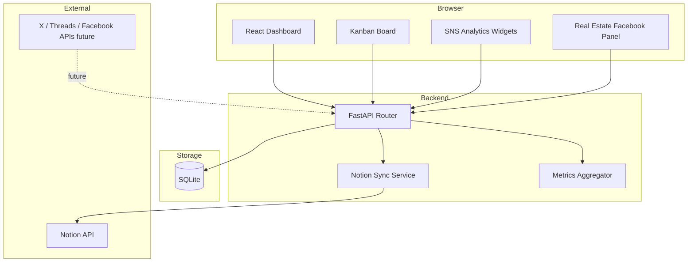
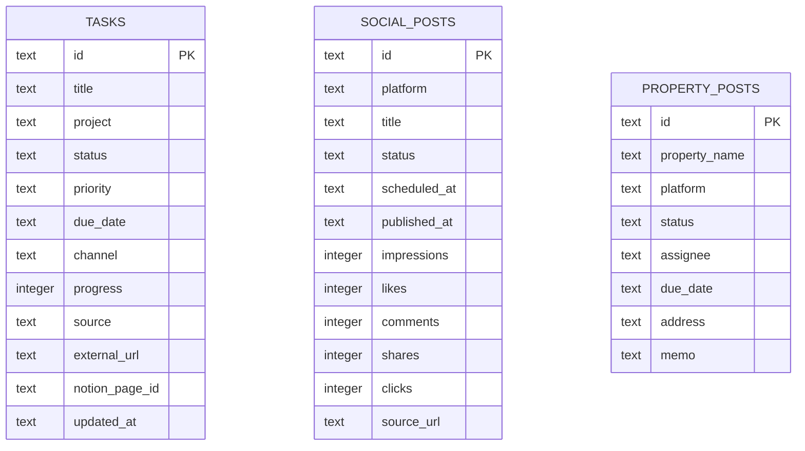

# Architecture

## 目的

このアプリは、ユーザーがNotionで管理している日々のタスク、SNS運用、ブログ/LP/開発、不動産Facebook投稿を1画面で見える化するための統合ダッシュボードです。

## 全体像

## デザイン方針

GPT Imageで作成した参照イメージを元に、以下の方向でUIを実装しています。

- ダークモードを基調にしたSaaS管理画面
- 青、紫、緑、ピンクのネオンアクセント
- 左サイドバー + 上部ヒーロー + KPIカード + かんばん + 分析パネル
- タスクは期限、優先順位、案件名、進捗率をカード内に集約
- SNS/不動産投稿は運用担当者が一目で状態判断できる密度に調整

## バックエンド

FastAPIがAPIを提供します。

| Endpoint | 内容 |
| --- | --- |
| `GET /api/health` | 死活監視 |
| `GET /api/dashboard-summary` | KPI集計 |
| `GET /api/tasks` | タスク一覧 |
| `POST /api/tasks` | 手動タスク追加 |
| `PATCH /api/tasks/{task_id}` | ステータスや進捗の更新 |
| `POST /api/sync/notion` | Notionタスク同期 |
| `GET /api/social-posts` | SNS投稿一覧 |
| `POST /api/social-posts` | SNS投稿追加 |
| `GET /api/property-posts` | 不動産Facebook投稿一覧 |
| `POST /api/property-posts` | 不動産投稿追加 |

## データベース

初期実装ではSQLiteです。単独利用やMVPでは運用が簡単で、将来的にPostgreSQLへ移行しやすいテーブル構造にしています。

## Notion同期

`backend/app/notion_client.py` がNotion APIを呼び出します。

- `NOTION_API_KEY` と `NOTION_TASK_DATABASE_ID` が未設定の場合、同期APIは安全にスキップします。
- Notionの新しいデータソースqueryエンドポイントを先に試し、404の場合は従来のdatabase queryへフォールバックします。
- NotionページIDを `notion_page_id` として保存し、再同期時はupsertします。

## CI/CD

GitHub Actionsで以下を実行します。

1. Python 3.12セットアップ
2. backend依存関係インストール
3. backend pytest
4. Node.js 20セットアップ
5. frontend依存関係インストール
6. TypeScript型チェック
7. frontend vitest
8. frontend build
9. build artifact upload

## 今後の拡張

- Notionへの逆同期
- X API / Facebook Graph API / Threads API連携
- CSVインポートによるSNS実績取り込み
- PostgreSQL移行
- 案件ごとの売上・工数・成果指標
- 認証、ユーザー別ビュー、ロール管理
- Slack/LINE通知
