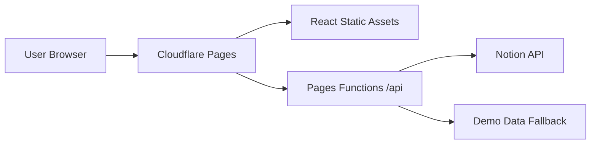

# Production URL / Cloudflare Deployment

## 予定URL

Cloudflare Pagesのproject nameを `notion-creator-ops-dashboard` に固定しているため、デプロイ完了後の標準URLは以下です。

- App: `https://notion-creator-ops-dashboard.pages.dev`
- API Health: `https://notion-creator-ops-dashboard.pages.dev/api/health`
- Tasks API: `https://notion-creator-ops-dashboard.pages.dev/api/tasks`

## 現在の状態

このrepoにはCloudflare Pages / Functionsで本番URLを発行するための構成を追加済みです。

- `.github/workflows/deploy-cloudflare.yml`
- `frontend/functions/api/[[path]].js`
- `frontend/wrangler.toml`

`CLOUDFLARE_API_TOKEN` と `CLOUDFLARE_ACCOUNT_ID` がGitHub Actions Secretsに入ると、pushまたはmanual dispatchでCloudflareへdeployされます。

## Cloudflare側の必要Secrets

GitHub repoの `Settings` → `Secrets and variables` → `Actions` に以下を登録します。

| Secret | 内容 |
| --- | --- |
| `CLOUDFLARE_API_TOKEN` | Cloudflare Pages deploy権限を持つAPI Token |
| `CLOUDFLARE_ACCOUNT_ID` | Cloudflare Account ID |

Notion本番同期をCloudflare Functionsで使う場合は、Cloudflare Pages projectのEnvironment Variablesにも以下を登録します。

| Variable | 内容 |
| --- | --- |
| `NOTION_API_KEY` | Notion Integration Secret |
| `NOTION_TASK_DATABASE_ID` | Notion task database / data source ID |
| `NOTION_PROP_TITLE` | 既定値 `Name` |
| `NOTION_PROP_STATUS` | 既定値 `Status` |
| `NOTION_PROP_PRIORITY` | 既定値 `Priority` |
| `NOTION_PROP_DUE_DATE` | 既定値 `Due Date` |
| `NOTION_PROP_PROJECT` | 既定値 `Project` |
| `NOTION_PROP_CHANNEL` | 既定値 `Channel` |
| `NOTION_PROP_PROGRESS` | 既定値 `Progress` |

## API構成

Cloudflare Pages Functionsで `/api/*` を受け、Reactフロントエンドは同一ドメインの `/api` を叩きます。

Cloudflare Secrets未設定時はデモデータAPIとして動き、Notion Secrets設定後は `/api/tasks` がNotion APIからタスクを取得します。
